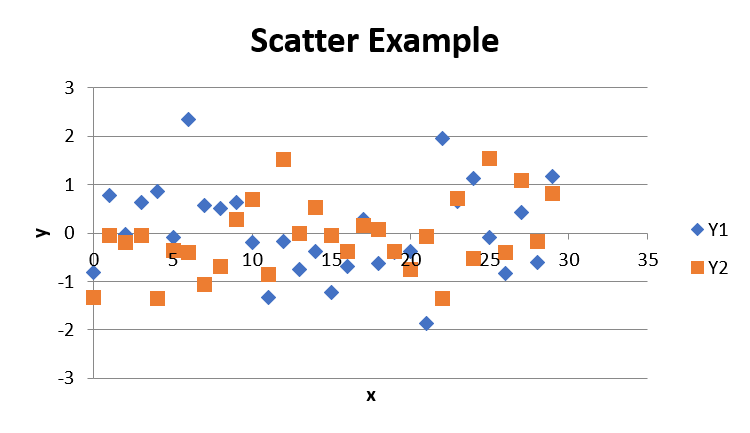

===================================
Quick-start
===================================

Quick-start for xl_link

Installation
============
xl_link depends on at least Pandas 0.19.

On windows this is most easily installable by using Anaconda which you can get here:

https://www.anaconda.com/download/

Anaconda is a Python installation pre-packed with a bunch of scientific python libraries, including Pandas.

To install is as simple as::

    pip install xl_link

Excel Engines
=============
Similarly to Pandas, xl_link provides a wrapper to some popular excel writing modules,
which it uses to provide easy chart creation from DataFrames.

Which one you use is dependent on what features you want, and what API syle you prefer.

Currently supported engines are:

   * XlsxWriter: http://xlsxwriter.readthedocs.io (version >=0.9)
   * openpyxl: https://openpyxl.readthedocs.io (version >=2.4)

Both of which have similar capabilities and syntaxes, and can be installed through pip.

Pandas DataFrames
=================
Pandas is a 'Powerful data analysis toolkit', with the core class being the ``DataFrame``. A ``DataFrame`` is essentially a table,
but pandas provides a ton of additional methods and properties that make manipulating these DataFrames easy.

For more detail on some of the capabilities of pandas check out their documentation here:

http://pandas.pydata.org/

From our perspective the most important feature of DataFrames is that they can be exported as Excel spreadsheets.

This is done by calling the ``to_excel`` method e.g.::

    >>> import pandas as pd
    >>> f = pd.DataFrame(data={'x': list(range(10)),
                               'y': list(range(10, 20))})
    >>> f.to_excel("book.xlsx")

Whilst this is useful, what if you want to add things to ``book.xlsx`` based off of ``f``? With both `xlsxwriter` and `openpyxl`, you need to know either the cell name or range,
or the row and column number to make changes. 

Given that you know the shape of your DataFrame, and where in the spreadsheet they were written surely there must be a way to know where each element of your frame is in the document...?

This is where xl_link steps in. xl_link provides a subclass of ``DataFrame``, ``XLDataFrame`` where the ``to_excel`` method has been modified to return an ``XLMap`` object:

The XLMap class
===============
The ``XLMap`` class is returned from ``XLDataFrames.to_excel``, and acts similarly to the original DataFrame, however, rather than holding the data from the original frame, it holds it's position within the spreadsheet.

This is perhaps easier to demonstrate::

	>>> from xl_link import XLDataFrame # Rather than pandas DataFrame
	>>> f = XLDataFrame(data={'x': list(range(10)),
	                          'y': list(range(10, 20))})
	>>> xlmap = f.to_excel("book.xlsx")
	>>> xlmap
		<XLMap: index: <XLRange: 'Sheet1'!A2:A11>, columns: <XLRange: 'Sheet1'!B1:C1>, data: <XLRange: 'Sheet1'!B2:C11>>

so xlmap represents ``f`` within Sheet1, where the index occupies A2:A11, the columns occupy B1:C1, and the data B2:C11.

``index``, ``columns`` and ``data`` are all attributes of xlmap, and can be accessed directly. 
These attributes are all XLRange objects, simply represent a range in a spreadsheet, and can be turned into their corresponding range string through ``xl_range.range``, they can do a bunch of other stuff which you should check out in the API!

As well as the ``index``, ``columns`` and ``data`` attributes, you can also use pandas indexing on the ``XLMap`` to get ``XLRange`` s and ``XLCell`` s:

At present ``XLMap`` implements ``loc``, ``iloc``, ``at`` and ``iat`` indexing, as well as ``__getitem__`` (e.g. ``f['x']``). Here are some examples:

	>>> xlmap.data
		<XLRange: 'Sheet1'!B2:C11>
	>>> xlmap.iloc[2:4, 1]
		<XLRange: 'Sheet1'!C4:C5>
	>>> xlmap['y']
		<XLRange: 'Sheet1'!C2:C11>

These methods become particuarly useful when combined with your excel engine of choice.
Both ``xlsxwriter`` and ``openpyxl`` are based on workbook, and worksheet classes, and more detail of using them can be found in their respective documentation. 
xl_link utilises the ``pandas.ExcelWriter`` class which wraps both xlsxwriter and openpyxl, providing access to the worksheet and workbook for a particuar document.
``pandas.ExcelWriter`` object can be created directly, taking the filename, and engine as parameters e.g.::

	>>> import pandas as pd
	>>> writer = pd.ExcelWriter('example.xlsx', engine='xlsxwriter')
	>>> writer
		<pandas.io.excel._XlsxWriter at 0x283dd9cf588>
And the workbook object can be accessed with::

	>>> writer.book
		<xlsxwriter.workbook.Workbook at 0x283dd9cf3c8>
		
a dictionary of the workbook's sheets::

	>>> writer.sheets
	
When looking through the documentation for your excel engine, knowing how to access your workbook and sheets is very useful.

A pandas ``ExcelWriter`` can be passed as the first argument to ``XLDataFrame.to_excel``, or if a path is provided, internally, a writer is created, corresponding to the filename and engine.

``XLMap`` keeps ahold of a reference to the writer used to create itself, and also the sheet it was written to (Note this is a single sheet, not the same as sheet **s** !) e.g. with xlmap from above::

	>>> xlmap.writer
		<pandas.io.excel._XlsxWriter at 0x283db2cccc0>
	>>> xlmap.sheet
		<xlsxwriter.worksheet.Worksheet at 0x283db2cca20>

The sheet attribute is handy for adding charts to the same sheet as your frame!

Note
++++
when using ``xlsxwriter`` as your engine, because ``xlsxwriter`` can't modify existing documents,
xl_link suppresses the saving of ``xlsxwriter.workbook.Workbook`` objects after calling to_excel (the default behaviour in Pandas). This means your spreadsheet won't appear until you explicitly save it this can be done by calling ``ExcelWriter.save()`` e.g.::
		
	>>> xlmap.writer.save()
	
	or 
	
	>>> writer.save()
	
	or if directly using a Workbook object
	
	>>> workbook.save()
	
Charts
======

The final thing ``XLMaps`` can do is generate charts. These charts belong to whatever engine you are using, so if there are any tweaks you want to make to the charts, 
first check out the ``XLMap.create_chart`` method in the API (because there might be an easy way!), or check out the chart docs in your excel engine.

The ``create_chart`` method is intended to be similar to the ``DataFrame.plot`` method, whereby sensible defaults mean you often hardly have to specify any arguments.

Expanding on the example above::

    Let's make some changes to f
	
	>>> f['y2'] = [1, 6, 8, 1, 4, 8, 3, 8, 7, 10]
	>>> f.set_index('x', inplace=True, drop=True)
	
	Get our XLMap
	
	>>> xlmap = f.to_excel('chart.xlsx', engine='openpyxl')
	
	create a scatter chart, and insert it into the document
	
	>>> chart = xlmap.create_chart('scatter')
	>>> xlmap.sheet.add_chart(chart, 'D1') # from openpyxl docs (xlsxwriter is different!)
	>>> xlmap.writer.save()
	
Creates:

The first parameter is the chart type, all chart types for each engine should be supported i.e.:

**xlsxwriter** :

    * area
    * bar
    * column
    * line
    * pie
    * doughnut
    * scatter
    * stock
    * radar

check out their chart docs here: http://xlsxwriter.readthedocs.io/chart.html

**openpyxl** :

	

    * Area Charts
    * Bar and Column Charts
    * Bubble Charts
    * Line Charts
    * Scatter Charts
    * Pie Charts
    * Doughnut Charts
    * Radar Charts
    * Stock Charts
    * Surface charts

check out their chart docs here: https://openpyxl.readthedocs.io/en/default/charts/introduction.html

chart subtypes are also supported, just pass the ``subtype`` keyword parameter to ``create_chart``

Other parameters you may want to use are:

**values** - in all charts is the dependent variable (e.g. y)

**categories** - for most charts this is used to categorise values data, but can also be used as x values (e.g. in scatter), multiple series can be under the same category.

**names** - these are used to label each series.

Things to keep in mind is, how to add your chart to a sheet. e.g.::

    in xlsxwriter
	
	>>> sheet.insert_chart('A1', chart) # position comes first
	
	in openpyxl
	
	>>> sheet.add_chart(chart, 'A1') # position comes second
	
Make sure you don't mix two different engines, also charts can only be inserted into a sheet from the workbook that created it.

Where Next?
===========
That concludes the quickstart for xl_link, any feedback or questions, submit an issue on the xl_link github: https://github.com/0Hughman0/xl_link/issues

Check out the API docs for more info!

